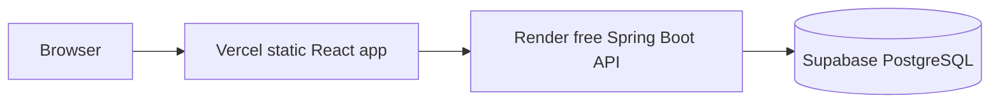
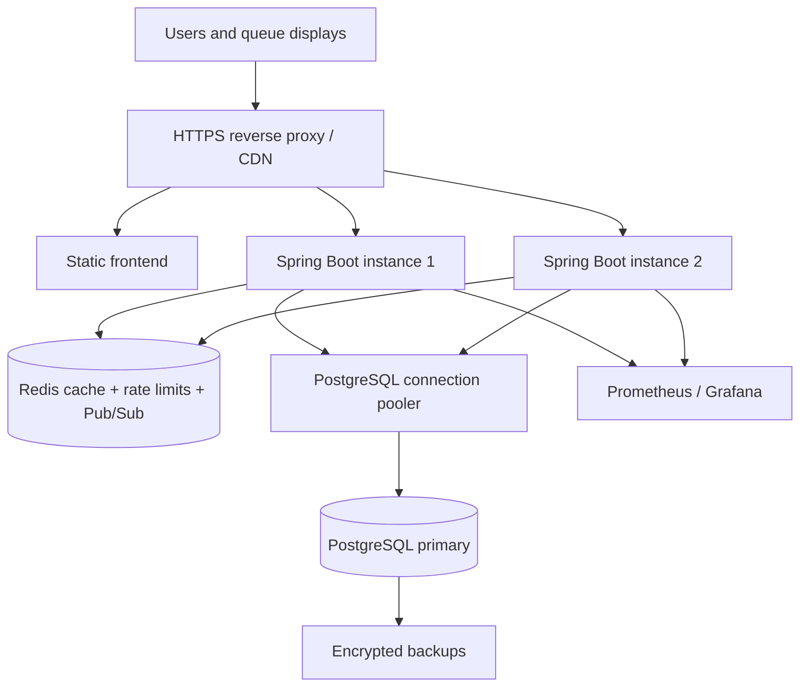

# CareBridge RMS Architecture

This document separates the architecture used by the free student demo from the architecture I would deploy for a larger hospital. The demo is intentionally small and inexpensive; it is not a claim that free hosting provides production availability or compliance guarantees.

## Current Free-Tier Demo

- Frontend: React + TypeScript + Vite deployed from `frontend/` to Vercel.
- Backend: one Spring Boot Docker web service deployed to Render's free tier.
- Database: Supabase PostgreSQL using the `prod` Spring profile and SSL.
- Schema: Flyway migrations in `backend/src/main/resources/db/migration`.
- Cache: none. PostgreSQL remains the source of truth.
- Real-time queue: the current STOMP/SockJS broker is in-process. This is acceptable for one backend instance only.
- Scale expectation: portfolio demo and light testing, not a guaranteed 100 RPS service.

### Free-tier tradeoffs

A single free backend can sleep, have limited memory/CPU, and have cold-start latency. Supabase free projects can also pause or impose storage/connection limits. The combination is suitable for a live portfolio demo, but uptime, latency, backups, and data retention are controlled by provider limits. Do not use real patient data on this deployment.

## Request Flow

1. The browser sends HTTPS requests to the Vercel frontend.
2. The frontend uses `VITE_API_URL` to call the Render API.
3. Spring Security validates the JWT and applies role checks.
4. Service methods run transactional business operations.
5. Hibernate uses HikariCP to connect to Supabase PostgreSQL.
6. Flyway owns schema changes; Hibernate validates the production schema.
7. Writes invalidate or update any future cache and publish queue events when a shared broker exists.

## Correctness Decisions

### UHID and appointment tokens

The old `MAX(value) + 1` pattern could allocate the same identifier to concurrent requests. The application now uses `sequence_counters`, a database table with a unique key and pessimistic row locking. Patient keys are year-scoped; appointment keys are doctor-and-day scoped. The unique database constraints remain the final protection.

This is correct for the current one-instance free deployment. A future multi-instance deployment should replace the JVM synchronization in the allocator with a PostgreSQL atomic upsert/returning query or a dedicated counter service.

### Pagination

Large collection endpoints accept `page` and `size` query parameters. The default is 25 records and the maximum is 100. The response remains an array so the current frontend does not break. A future API version can return `{ content, page, size, totalElements }` when the UI needs page controls.

### Schema and indexes

`V1__initial_schema.sql` creates the PostgreSQL schema, foreign keys, uniqueness constraints, counters, and indexes. Production uses `ddl-auto=validate`; schema changes must be reviewed migrations. Existing non-empty databases are baselined at version 0 and the idempotent initial migration adds missing objects.

## Full Production Architecture at Scale

### Suggested server profile

For the earlier target of 100 sustained requests/second and 300 concurrent active users:

- 8 dedicated vCPU
- 16 GB RAM
- 200 GB SSD with monitored free space
- Ubuntu LTS, Docker, and a firewall
- Two backend containers, each with roughly 1-1.5 GB heap
- PostgreSQL sized at 2-4 GB RAM initially
- Redis capped around 512 MB
- Prometheus/Grafana and structured logs with retention limits

This is a capacity target, not a guarantee. A k6/JMeter benchmark using realistic authenticated reads and writes is the final authority.

### PostgreSQL concurrency

Start conservatively:

- Hikari pool: 20 connections per backend instance
- Two instances: 40 application connections total
- PostgreSQL `max_connections`: around 150, leaving room for migrations, admin, and monitoring
- Use a pooler for managed PostgreSQL when provider limits are tight
- Keep transactions short and avoid holding connections while doing network work
- Monitor locks, slow queries, pool wait time, CPU, and cache hit ratio

Do not equate 300 concurrent users with 300 database connections. Most users are idle between requests.

### Redis responsibilities

Redis should handle short-lived, non-authoritative data:

- Queue snapshots: 1-5 second TTL
- Doctor/reference lists: 5-15 minute TTL
- Dashboard aggregates: 15-60 second TTL
- Rate-limit counters and idempotency keys
- Pub/Sub events for queue updates between backend instances

Patient records, payments, prescriptions, and authorization decisions remain PostgreSQL-backed. The write sequence is PostgreSQL commit, cache invalidation, then event publication.

### Real-time queue

The current in-memory STOMP broker works with one backend. At two instances, Redis Pub/Sub or a broker such as RabbitMQ is required so a queue update received by instance 1 reaches clients connected to instance 2. WebSocket is the primary update path; polling is a fallback, not the main mechanism.

### Edge and security

- Terminate HTTPS with Caddy or Nginx and Let's Encrypt.
- Proxy `/api` and `/ws`; never expose PostgreSQL or Redis publicly.
- Restrict CORS to the actual frontend origin using `CORS_ALLOWED_ORIGINS`.
- Use a strong secret outside Git and rotate it through the deployment provider.
- Keep access tokens short-lived and add refresh-token rotation for a real deployment.
- Add request size limits, rate limits, security headers, and protected metrics endpoints.
- Do not seed demo passwords in a production database.

### Observability and recovery

Monitor request rate, P95/P99 latency, 4xx/5xx rates, JVM heap, thread pools, WebSocket connections, database pool waits, locks, slow SQL, Redis evictions, disk, and container restarts. Back up PostgreSQL daily, copy backups away from the application host, encrypt them, and test restoration. A practical starting objective is RPO 24 hours and RTO 2-4 hours.

## Main Tradeoffs

| Decision | Benefit | Cost or limitation |
|---|---|---|
| One Render free instance for demo | No card required and simple | Sleep/cold starts and one application failure point |
| Supabase PostgreSQL | Managed database and SSL | Free-tier limits and possible pause |
| No Redis in demo | Fewer services and no operational overhead | No shared cache or cross-instance events |
| Flyway | Reviewable, repeatable schema changes | Migrations require discipline |
| Array responses with bounded pages | Keeps current UI compatible | No total count metadata yet |
| Database-locked counters | Prevents same-process concurrent allocation | Counter creation must be upgraded for multiple app instances |
| Two backend instances at scale | Better availability and concurrency | Requires shared Redis events and more resources |
